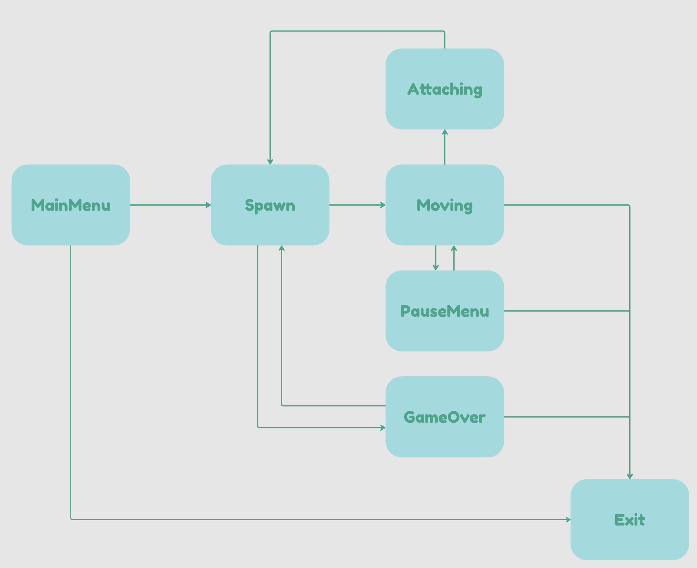
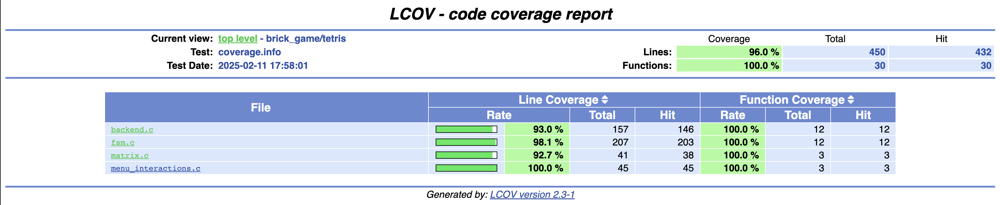
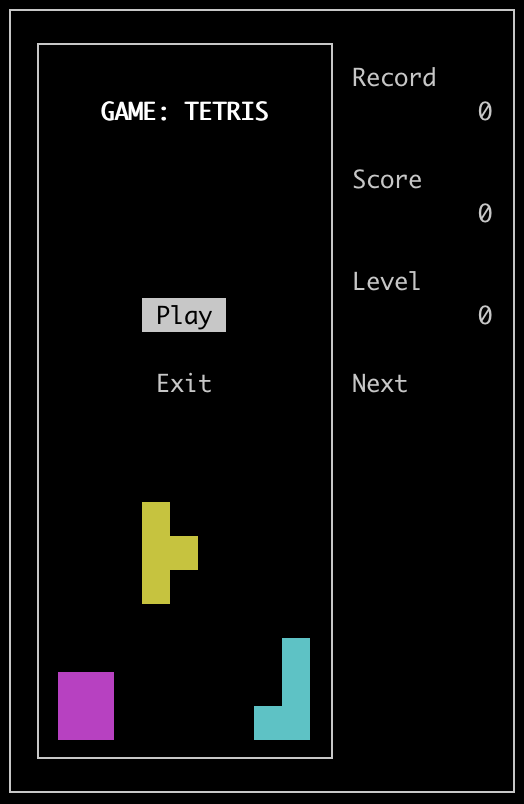
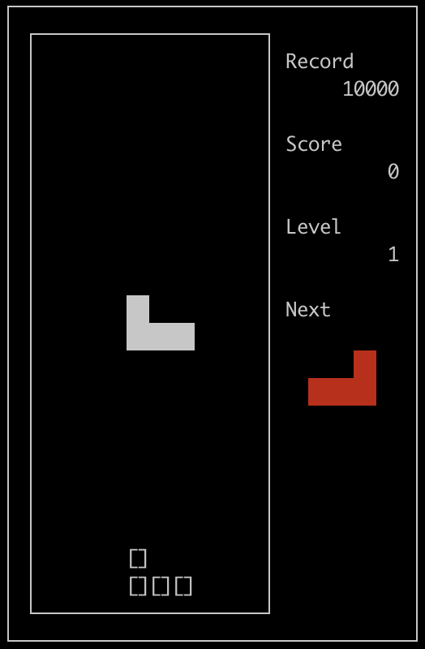
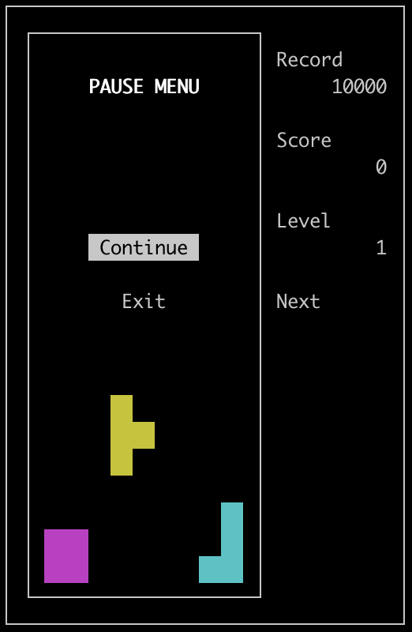
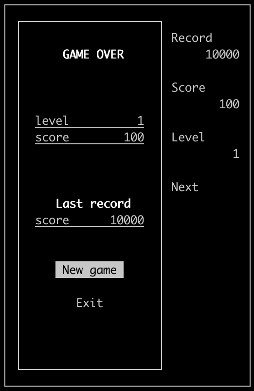

# Tetris in C (console version)

A classic Tetris implementation in C using ASCII graphics in the terminal.

## Features
- Classic tetris rules  
- Keyboard controls  
- Score system  
- Progressive difficulty (speed increases)  
- Next piece preview  
- Display where the current piece will drop
- ASCII interface  

## Requirements
- C compiler (GCC)  
- Linux/macOS Terminal  
- Installed `ncurses` library  

## Installation & Running
1. Clone the repository  
2. Compile the program using `make install`  
3. Start the game using `make play`  

## Controls
Left Arrow - Move piece left  
Right Arrow - Move piece right  
Down Arrow - Soft drop (accelerate fall)  
Space - Rotate piece  
P - Pause game  
ESC - Quit game  

## Technical features
- Game realized using FSM (finite state machine)  
  
- 7 types of tetromino:  
  
- The progect includes unit tests covering all backend functions:  
  
To run tests and coverage report use `make test` and `make gcov_report`.  
- Documentation done using Doxyfile. For creation use `make dvi`.  

## Screenshots
  
  
  
